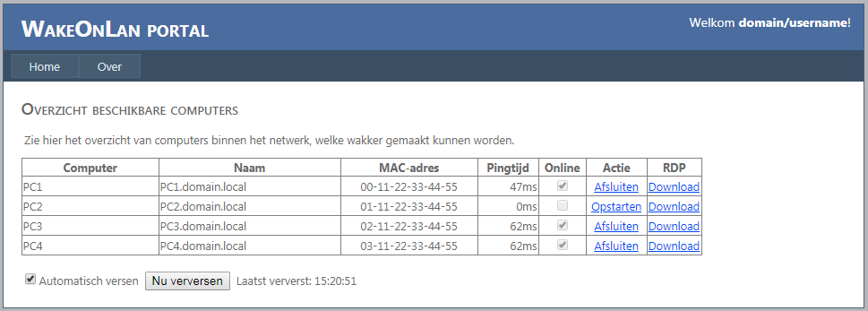

# WakeOnLanPortal LITE
Web-based portal using WakeOnLan library

Based on the heavier version of WakeOnLanPortal, but without login pages and LDAP support:
https://github.com/ronaldhoek/WakeOnLanPortal

# Library usage
This project uses the Aquila Technology WakeOnLan library (WOL.dll)
* Homepage: https://wol.aquilatech.com/
* Source: https://github.com/basildane/WakeOnLAN/

# Configuration
Please create your own 'machines.xml' file based on the sample (or use the AquilaWOL application to create one).
* Download: https://github.com/basildane/WakeOnLAN/releases/

To limit the usage of the WakeOnLan Portal, please configure IIS security settings to use Windows or Basic authentication.
